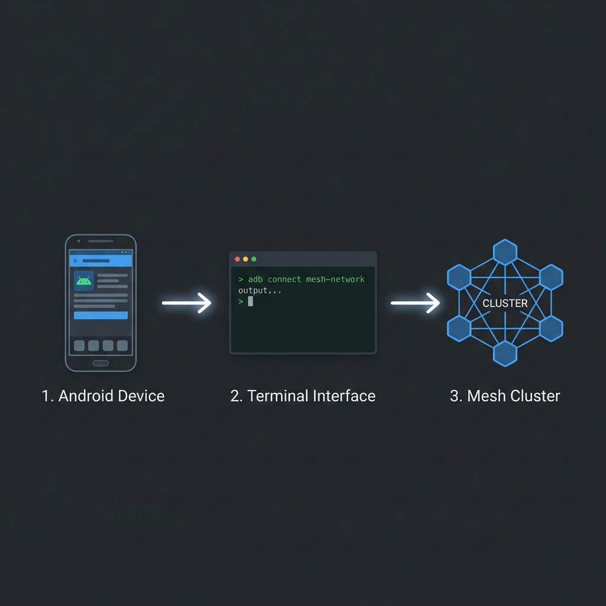

# Android K3s Worker Node Project


Turn your old Android devices into productive Kubernetes worker nodes using K3s.

## Project Manifesto

The goal of this project is to democratize edge computing by upcycling consumer electronics. Billions of "obsolete" Android phones sit in drawers, possessing powerful ARM CPUs, built-in battery backups (UPS), and WiFi connectivity. We bypass the restrictive Android ecosystem (which blocks standard Linux setups) using techniques like **Termux (Proot)** or **Chroot** environments, effectively layering a GNU/Linux userspace over the Android kernel to run container orchestrators like K3s.

## Critical Analysis

| Feature       | Pros                                     | Cons                                      |
| :------------ | :--------------------------------------- | :---------------------------------------- |
| **Power**     | Built-in Battery (UPS) - survive outages | Thermal Throttling under 24/7 load        |
| **Compute**   | Decent ARM64 cores (often 8-core)        | Limited RAM (2GB-4GB common)              |
| **Network**   | WiFi builtin                             | Latency usage; no native Ethernet often   |
| **OS/Kernel** | Already installed                        | Missing cgroups/modules; "Franken-kernel" |

## In-Depth Directory Structure

This repository contains the "Golden" setup kit for your node.

```text
k3s-server/
├── README.md                 # This blueprint
├── scripts/
│   └── setup-node.sh         # The 'Golden' setup script to fix cgroups & env
└── config/
    └── k3s-agent-config.yaml # Low-power optimized agent configuration
├── demo-app/                 # Production-ready Go reference implementation
│   ├── Dockerfile            # Multi-stage, distroless, non-root optimized
│   ├── deployment.yaml       # K8s manifest with probes & limits
│   └── main.go               # Sample app with graceful shutdown
```

## Production Reference: Demo App

The `demo-app/` directory contains a "Gold Standard" reference implementation for running workloads on your new Android nodes. It is critical for these resource-constrained devices that applications are optimized.

**Key Features:**

- **Zero-Fat Images**: Uses multi-stage builds and `distroless` base images to keep containers under 20MB.
- **Safety First**: Runs as a non-root user to protect the host node.
- **Resanable Defaults**: Includes Liveness/Readiness probes and Memory/CPU limits to prevent node crashes.

Use this directory as a template for your own applications.

## User Journey: From Drawer to Node



Follow this guide to convert your device.

### Phase 1: Preparation

1.  **Unlock & Root**: Your Android device **must** be rooted to mount cgroups and manage networking.
2.  **Linux Environment**: Install _Linux Deploy_ (recommended for beginners) or set up a _Termux_ root shell.
    - _Tip_: Use a lightweight distro like Alpine or Ubuntu Server.
3.  **SSH Access**: Ensure you can SSH into the device from your PC.

### Phase 2: Copy Files

Transfer this project folder to your Android device (e.g., via `scp` or `git clone`).

```bash
scp -r k3s-server user@android-ip:~/
```

### Phase 3: The Golden Setup

Run the automated setup script to patch the environment.

```bash
cd k3s-server/scripts
sudo chmod +x setup-node.sh
sudo ./setup-node.sh
```

_This script will fix the missing cgroup hierarchies that usually cause K3s to fail on Android._

### Phase 4: Ignite the Node

Join the node to your existing K3s cluster.

**Important**: You must have a K3s Master running first. See [k8s-install/README.md](k8s-install/README.md) for master setup instructions.

Once you have your `K3S_TOKEN` and `K3S_URL` from the master:

```bash
# Set your server details
export K3S_URL="https://192.168.1.100:6443"
export K3S_TOKEN="K10..."

# Install and start using the optimized config
curl -sfL https://get.k3s.io | sh -s - agent \
  --config ../config/k3s-agent-config.yaml
```

### Phase 5: Verify

On your server node, run:

```bash
kubectl get nodes
```

You should see your Android device listed as `Ready` with the label `device_type=android`.
