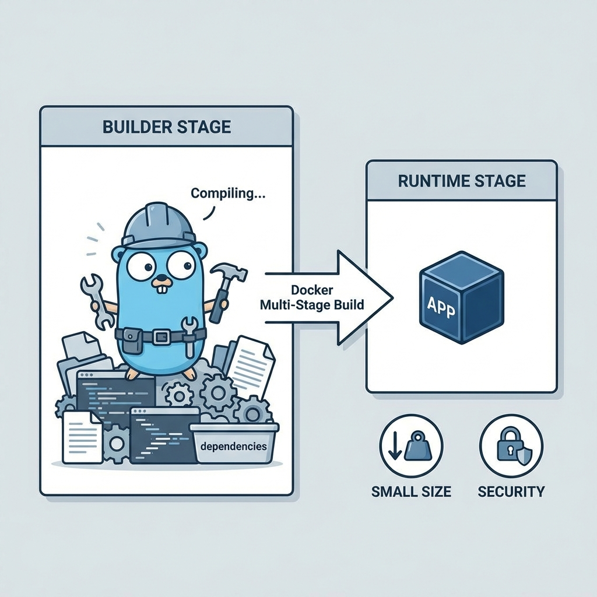
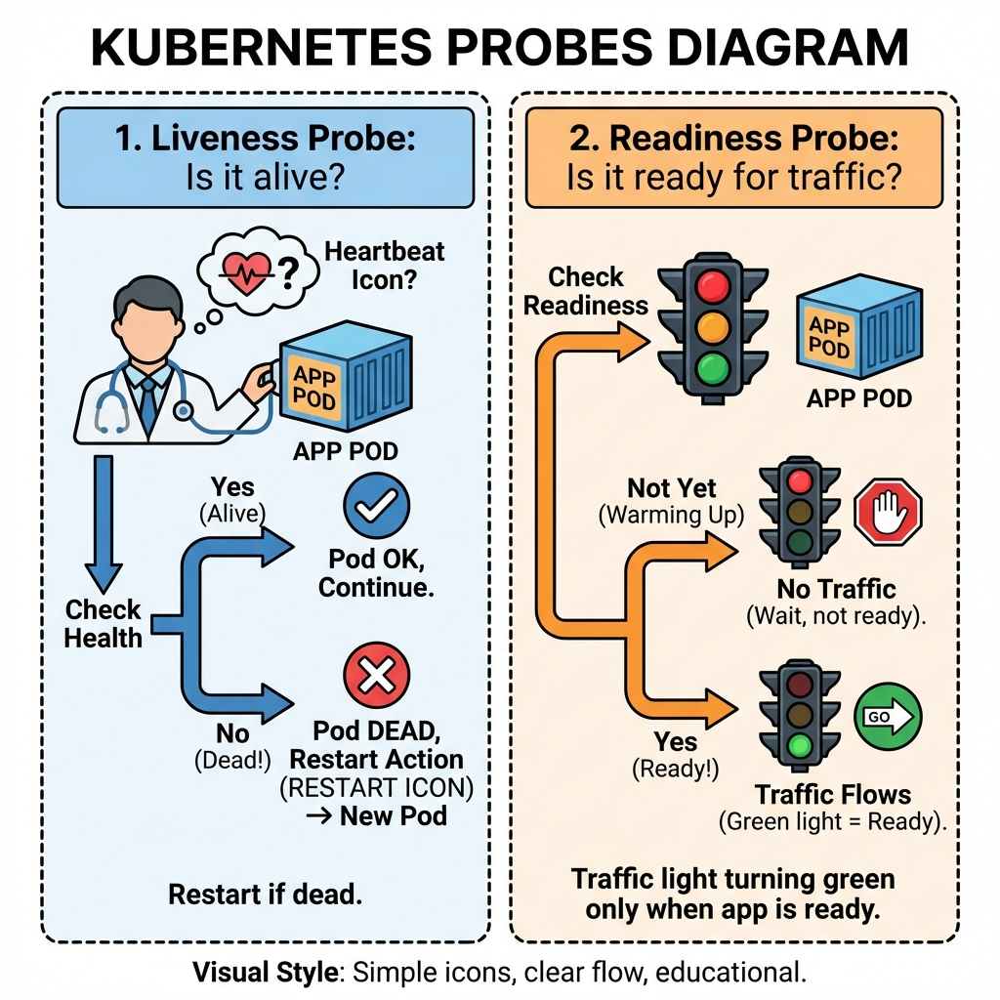
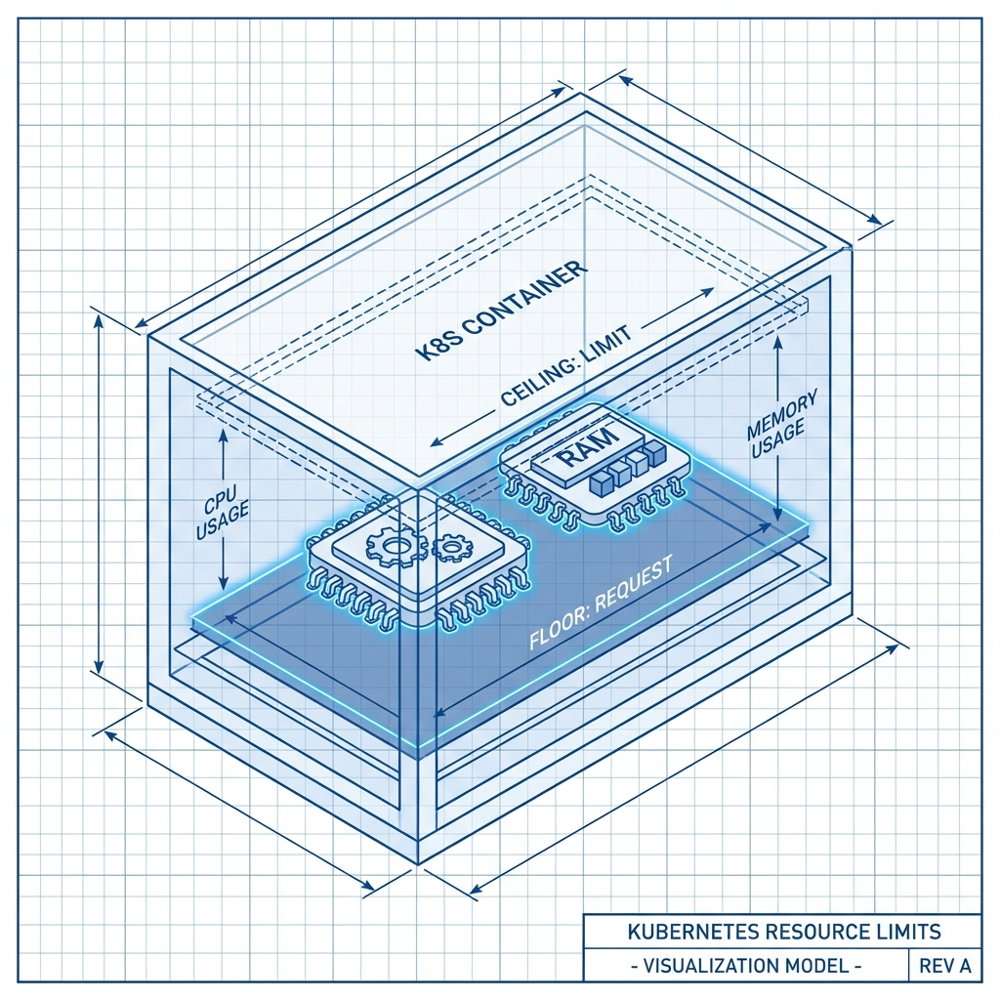

# Kubernetes & Docker Best Practices Guide

This guide explains the design choices made in the `demo-app` and how they contribute closer to a production-ready setup, especially for resource-constrained environments like Android worker nodes.

## 1. Dockerfile Optimization

### Multi-Stage Builds

**Why:**

- Separation of "Build" and "Runtime" environments.
- compilers (Go), header files, and build tools remain in the first stage.
- Result: Significantly smaller image sizes (often < 15MB for Go apps) and reduced attack surface.

  

### Distroless Images

**Why:**

- We use `gcr.io/distroless/static:nonroot`.
- Contains _only_ your application and its runtime dependencies.
- No shell (`/bin/sh`), no package manager (`apk`/`apt`), no unnecessary binaries.
- If an attacker compromises your app, they cannot easily "shell out" to do more damage.

### Non-Root User

**Why:**

- Running as `root` inside a container is a security risk. If the container runtime has a vulnerability, the attacker could gain root access to the host node.
- We use user `65532` (standard non-root ID in distroless), enforcing the request `securityContext` in Kubernetes.

## 2. Kubernetes Integration

### Liveness & Readiness Probes

**Why:**

- **Liveness (`/healthz`)**: Kubernetes restarts the pod if this fails. It means "I am broken, kill me."
- **Readiness (`/readyz`)**: Kubernetes stops sending traffic if this fails. It means "I am busy or starting up, don't talk to me yet."
- Vital for zero-downtime deployments.

  

### Resource Limits (Requests vs. Limits)

**Why:**

- **Requests**: "I need at least this much to start." Kubernetes uses this for scheduling.
- **Limits**: "Do not let me use more than this." Kubernetes throttles CPU or kills the pod (OOMKill) if memory is exceeded.
- **Critical for Android Nodes**: You have limited RAM/CPU. Without limits, one runaway pod can crash the entire phone/node.

  

### Graceful Shutdown (SIGTERM)

**Why:**

- Kubernetes sends a `SIGTERM` signal when stopping a pod.
- Your app should catch this, finish current requests, and then exit.
- If you ignore it, Kubernetes will force kill (`SIGKILL`) the app after 30s, potentially dropping active connections.

### Security Context

**Why:**

- explicitly setting `runAsNonRoot: true` prevents the pod from scheduling if the image tries to run as root.
- `fsGroup` ensures mounted volumes are readable by the non-root user.

## 3. Worker Node Tips

- **Taints & Tolerations**: Use these to dedicate your Android nodes to specific workloads, preventing general heavy workloads from accidentally landing on them.
- **Node Affinity**: Prefer scheduling pods on architectures they are built for (`arm64` vs `amd64`).
